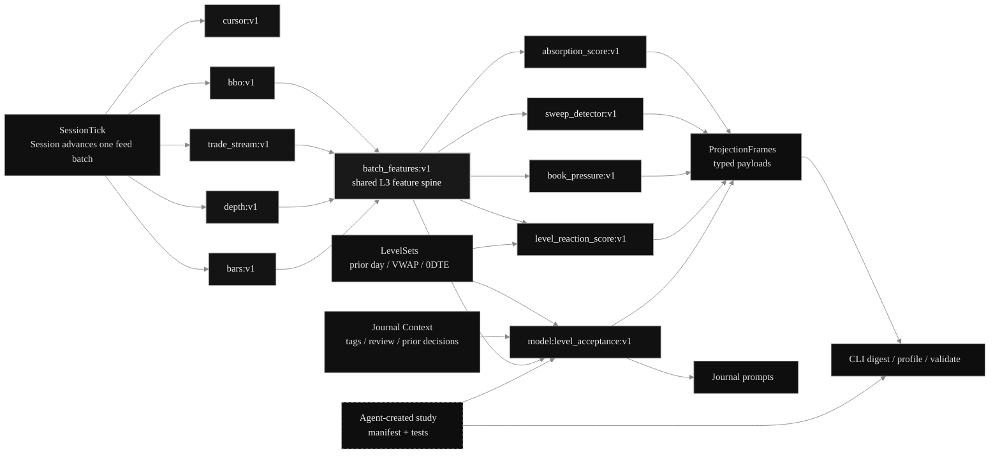
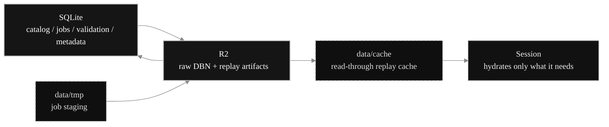

# Ledger

**Deterministic L3 replay infrastructure for rapid, traceable, agentic trading research.**

Ledger is the backend foundation for an ES-focused trading research and training system. Lens is the web operating surface. The point is not to draw another chart. The point is to own the full chain from raw L3 market data to replay truth, studies, execution simulation, journal context, and eventually live mode through the same downstream contracts.

The most important bet is this:

```text
deterministic runtime
  + typed contracts
  + CLI validation
  + journal traceability
  = rapid experimentation without losing control
```

Ledger should let humans and AI agents create useful trading tools quickly because the system gives them bounded extension points: manifests, schemas, dependencies, tests, deterministic replay, digestible outputs, and a journal that preserves exactly what was known at decision time.

That is the difference between this and a notebook. A notebook captures an idea once. Ledger should make an idea reproducible, testable, comparable, queryable, and safe to evolve.

## Core Idea

Ledger turns raw ES L3 data into a controlled experimental market-state engine.

```mermaid
%%{init: {"theme": "base", "themeVariables": {"background": "transparent", "primaryColor": "#111111", "primaryTextColor": "#e7e7e7", "primaryBorderColor": "#777777", "lineColor": "#8a8a8a", "secondaryColor": "#171717", "tertiaryColor": "#0d0d0d", "fontFamily": "ui-monospace, SFMono-Regular, Menlo, Consolas, monospace"}}}%%
flowchart LR
  classDef durable fill:#151515,stroke:#bbbbbb,color:#fff,stroke-width:1.5px;
  classDef runtime fill:#191919,stroke:#d6d6d6,color:#fff,stroke-width:2px;
  classDef surface fill:#111111,stroke:#888,color:#eee;
  classDef agent fill:#0e0e0e,stroke:#aaaaaa,color:#eee,stroke-dasharray:4 4;

  Raw["Raw ES L3 data<br/>DBN / MBO"]:::durable
  DataCenter["Data Center<br/>catalog / prepare / validate / trust"]:::surface
  Dataset["ReplayDataset<br/>immutable validated artifacts"]:::durable
  Feed["ReplayFeed<br/>historical market-data feed"]:::runtime
  Session["Session<br/>seek / advance / play / simulate"]:::runtime
  Truth["Exchange Truth<br/>canonical L3 book"]:::runtime
  Projections["Projection Runtime<br/>typed lazy DAG"]:::runtime

  Lens["Lens<br/>charts / DOM / workflow"]:::surface
  CLI["CLI<br/>headless validation"]:::surface
  Journal["Journal<br/>decision memory"]:::surface
  API["API / WebSocket<br/>transport only"]:::surface

  Contracts["Contracts<br/>manifests / schemas / tests"]:::agent
  Agents["Agents<br/>studies / reports / queries"]:::agent

  Raw --> DataCenter
  DataCenter --> Dataset
  Dataset --> Feed
  Feed --> Session
  Session --> Truth
  Truth --> Projections

  Projections --> Lens
  Projections --> CLI
  Projections --> Journal
  Projections --> API

  Contracts --> Projections
  Contracts --> CLI
  Agents --> Contracts
  Journal --> Agents
```



## Why This Exists

The hard part is preserving market truth and decision context while moving fast.

Ledger should answer questions like:

```text
What raw data did this result come from?
Was the ReplayDataset validated?
What did the L3 book actually look like?
What could the trader see at that session cursor?
What would have filled after latency and queue assumptions?
Which projection version produced this signal?
Was this signal causal, stale, async, or hindsight-only?
Can the result be reproduced by the CLI?
Can an agent safely modify the study and prove it still behaves?
Can the journal later find similar scenarios from live or replay?
```

The journal is not just a text log. It should eventually preserve the session cursor, visible projections, projection versions, fills, tags, levels, screenshots or view state, and selected study values. That makes it possible to ask useful questions later:

```text
Show me prior trades where this setup appeared.
Find days where this model was stale at entry.
Compare my journal notes against what the book-pressure study showed.
Replay similar failed auctions from the last two months.
Find live scenarios that match patterns I have already reviewed.
```

This is the loop Ledger is built to support:

```text
observe market behavior
  ↓
journal and label the context
  ↓
create or revise a study
  ↓
validate through deterministic replay
  ↓
compare against prior decisions
  ↓
promote useful outputs into Lens
  ↓
repeat quickly with traceability
```

## What Makes Ledger Different

| Area | Ledger approach |
| --- | --- |
| Replay | Validated ES L3 event replay, not approximate candle playback. |
| Market truth | One canonical order book per active Session. |
| Visibility | Trader-visible frames stay separate from exchange truth. |
| Execution | Simulated orders fill against truth after latency and queue assumptions. |
| Studies | Typed, versioned projections in a lazy DAG. |
| Efficiency | Shared base projections and L3 feature spines prevent repeated raw-event scans. |
| Agentic dev | Agents work through contracts, schemas, fixtures, tests, and CLI validation. |
| Journal | Decisions can reference exact cursor, fills, projections, versions, and context. |
| Storage | Durable R2 objects and disposable local cache are separated. |
| Live path | Replay and live converge below the UI through the same projection protocol. |

## Projection Runtime

The Projection Runtime is the next major system boundary.

A projection is any typed, time-indexed view over replay truth, visibility, execution state, level sets, journal context, external artifacts, or other projections.

A study is a projection with trading or research semantics.

The runtime should be:

```text
lazy        only subscribed projections and dependencies exist
typed       every output has a schema
versioned   every meaningful semantic change gets a new version
causal      training/live outputs cannot silently use future data
profiled    expensive work is explicit and measurable
validated   CLI proves behavior before API/Lens depend on it
```



## Projection Contracts

A projection is not just code. It has a contract.

```text
id + version
parameters
dependencies
output schema
source view
temporal policy
wake policy
frame policy
```

That current contract is intentionally small. It is enough for deterministic
replay projections and CLI validation without preloading execution, cache,
trust, validation, or visualization vocabulary before those features exist.

That contract is what makes agentic development practical. An agent should be
able to add a base projection without guessing where to plug it in. It declares
what it consumes, what it emits, and when it wakes. More advanced policy fields
can return when the platform has the feature pressure and tests to justify them.

## Execution Policy

Near-term projections run synchronously inside the active Session. Core
truth cannot be stale, and the first product goal is to make cursor, BBO,
canonical trades, and bars deterministic before introducing worker queues or
lag semantics.

Future async/offline/model projections will need explicit execution and
staleness policy. Those fields should be introduced with the feature that uses
them, not carried as unused schema.

## Replay Truth, Visibility, and Execution

Replay has three separate layers.

```text
Exchange Truth
  Exact historical event batches applied to one canonical L3 order book.

Trader Visibility
  Delayed/coalesced frames representing what the trader could actually see.

Execution Simulation
  Orders arrive after configured latency and fill against the true book at arrival time.
```

This prevents impossible training assumptions: perfect instantaneous information, impossible queue priority, and studies that quietly use future data.

## Storage Model

Ledger separates durable truth from local performance.



| Layer | Role |
| --- | --- |
| SQLite | Local control plane: catalog, jobs, object metadata, validation summaries, future journal/session/study state. |
| R2 | Durable object plane: raw DBN and replay artifacts. |
| `data/tmp` | Disposable staging for ingest and validation jobs. |
| `data/cache` | Disposable read-through cache for active replay performance. |

The cache can be deleted. Durable raw and replay artifacts remain in R2, with SQLite as the local control plane.

## Current Status

The foundation currently includes:

```text
Data Center API and Lens surface
SQLite control plane + R2 durable object storage
raw/replay layer separation
validation and trust summaries
persisted jobs and job history
ReplayDataset loading and validation
active feed-driven Session controller
headless CLI session run
Session WebSocket transport
local ReplayDataset cache
study graph vision and phased implementation plan
```

The next major implementation is the feed-driven Session path that makes replay
and live converge below Lens.

```text
Phase 1
  Refactor active replay into ReplayFeed -> Session -> SessionTick.

Phase 2
  Add deterministic session-clock validation.

Phase 3
  Expose Session over WebSocket. Implemented as transport over Ledger
  Session/ProjectionFrame primitives; Lens rendering is still next.

Phase 4
  Render projection frames in Lens.

Phase 5+
  Add visual projections, profiling, batch_features, derived studies,
  API/WebSocket projection subscriptions, Lens renderers, journaling,
  levels/gamma, model studies, checkpointing, and live mode.
```

Detailed planning:

```text
docs/vision.md
docs/study_graph_vision.md
docs/study_graph_phased_implementation.md
```

## Repository Layout

```text
crates/domain   shared pure types, market-day resolution, codecs, storage names
crates/book     deterministic L3 order-book truth
crates/replay   headless replay simulator, visibility, execution, latency, queue-ahead
crates/store    SQLite control plane, R2 object storage, jobs, validation summaries
crates/ingest   Databento/raw DBN ingest, preprocessing, replay artifact creation
crates/ledger   application orchestration shared by CLI and API
crates/api      HTTP transport adapter for Lens
crates/cli      terminal adapter for ingest, status, validation, session runs
lens            web operating surface
```

## CLI Examples

```bash
# Resolve an ES market day
cargo run -p ledger-cli -- resolve --symbol ESH6 --date 2026-03-12

# Ingest raw data and prepare replay artifacts
cargo run -p ledger-cli -- ingest --symbol ESH6 --date 2026-03-12

# Check catalog/storage status
cargo run -p ledger-cli -- status --symbol ESH6 --date 2026-03-12

# Validate replay readiness
cargo run -p ledger-cli -- session validate --symbol ESH6 --date 2026-03-12 --replay-batches 10000

# Run an active Session headlessly with a replay feed
cargo run -p ledger-cli -- session run --symbol ESH6 --date 2026-03-12 --batches 1000

# Validate clock-driven Session advancement without wall-clock sleeps
cargo run -p ledger-cli -- session clock-run \
  --symbol ESH6 \
  --date 2026-03-12 \
  --projection bars:v1 \
  --params '{"seconds":60}' \
  --speed 60 \
  --tick-ms 16 \
  --ticks 1000 \
  --budget-batches 500 \
  --digest \
  --truth-visibility
```

## Lens

```bash
cd lens
npm install
npm run dev
```

Lens currently focuses on data ownership and trust: market days, raw/replay layer status, jobs, validation, cache state, and Data Center actions.

Replay controls, charts, DOM, journal workflows, and agentic study creation come after the Session WebSocket boundary is connected to Lens.

## Philosophy

Ledger is being built from first principles because the hidden parts are the valuable parts:

```text
real L3 access
deterministic replay truth
honest visibility and execution simulation
typed projection graphs
bounded agentic extension points
CLI validation before UI exposure
journaling that preserves decision context
scenario search and replay from journal memory
live/replay convergence below the UI
```

If this foundation is right, Ledger becomes more than a replay tool. It becomes the substrate for fast experimentation, reproducible studies, traceable journals, AI-assisted research, and eventually a better live trading surface.
